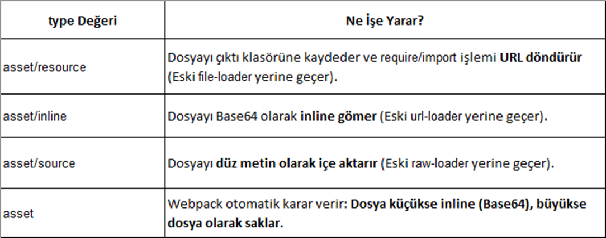
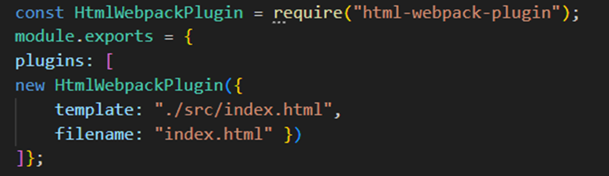
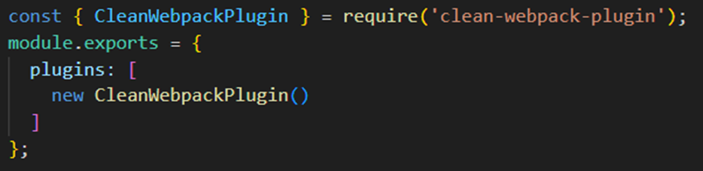
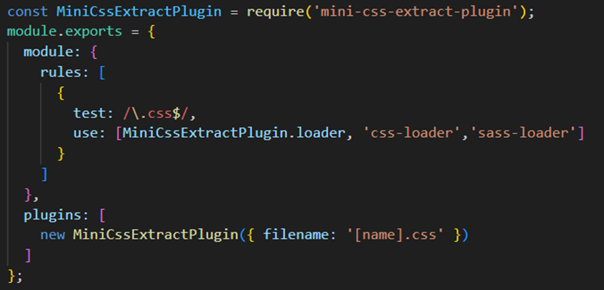
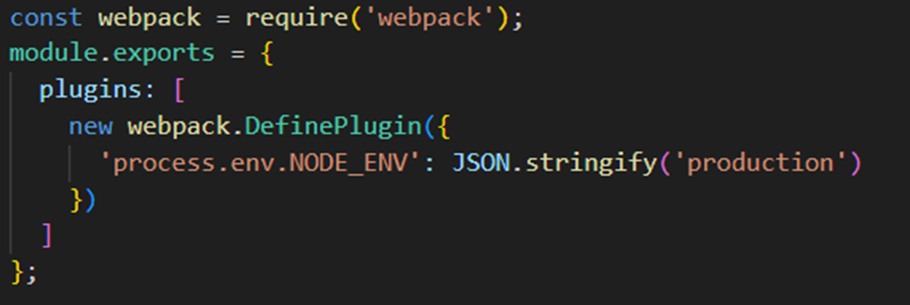
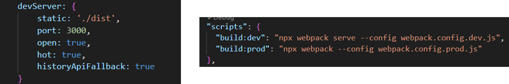
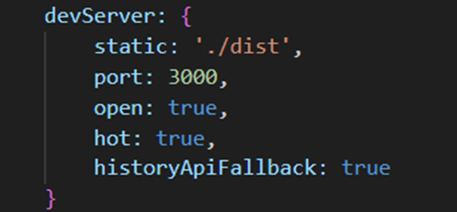
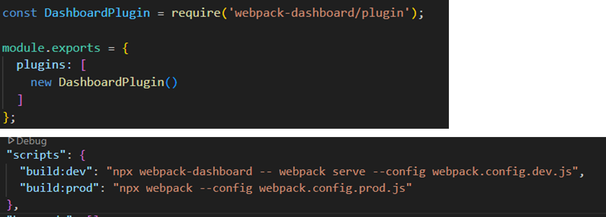

# WEBPACK 5 YOUTUBE EĞİTİMİ

## 1-Giriş ve Temel Bilgiler
Bu bölüm için örnek kod yok.

## 2- Webpack Kurulumu ve İlk Proje
### 2.1- Webpack'in Projeye Dahil Edilmesi
2.1.1. Node.js ve npm Kurulumu

Webpack'i kullanabilmek için öncelikle Node.js ve npm'in (Node Package Manager) sisteminizde yüklü olmalıdır.
Terminal veya komut istemcisine aşağıdaki komutu yazarak versiyonlarını kontrol edebilirsiniz:

```node
node -v
npm -v
```

2.1.2. Yeni Bir Proje Başlatma
Yeni bir proje klasörü oluşturup klasör içerisine geçin ve aşağıdaki komutu çalıştırarak bir package.json dosyası oluşturun.

```node
mkdir WebpackDemo
cd WebpackDemo
npm init -y
```

2.1.3. Webpack ve Webpack CLI Kurulumu

- Proje Bazlı Kurulum

```node
npm install --save-dev webpack webpack-cli
```
Kontrol etmek için:
```node
npx webpack -v
```
- Global Kurulum

```node
npm install -g webpack webpack-cli
```
Kontrol etmek için:
```node
webpack -v
```

### 2.2- Webpack CLI ve Temel Komutlar

2.2.1 Npx Nedir?
npx, npm ile gelen bir araç olup, proje bazlı olarak yüklenmiş paketleri çalıştırmaya yarar. Global olarak yüklemeden, doğrudan projenize ait bağımlılıkları çalıştırmak için kullanılır. Örneğin, Webpack'i proje içinde çalıştırmak için npx webpack komutu kullanılır.

2.2.2 Webpack’i Çalıştırma
Projede Webpack’i çalıştırmak için aşağıdaki komutu kullanabilirsiniz:

```node
npx webpack
```

Eğer webpack.config.js dosyanız yoksa, varsayılan olarak ./src/index.js dosyasını giriş noktası olarak alıp ./dist/main.js olarak çıktıyı oluşturur.

2.2.3 Geliştirme Modunda Çalıştırma
Geliştirme sürecinde daha hızlı derleme için aşağıdaki komut kullanılabilir:
```node
npx webpack --mode development
```

2.2.4 Yayınlama Modunda Çalıştırma
Optimizasyonlar ile birlikte Webpack’i çalıştırmak için:
```node
npx webpack --mode production
```

2.2.5 Özel Yapılandırma Dosyası Kullanma
Eğer farklı bir yapılandırma dosyası belirlemek istiyorsak:
```node
npx webpack --config webpack.custom.js
```

### 2.3- Webpack CLI ve Temel Komutlar
Webpack’in nasıl çalıştığını daha iyi anlamak için temel bir yapılandırma dosyası oluşturabiliriz.

2.3.1 Webpack Yapılandırma Dosyası Oluşturma
Proje dizininde webpack.config.js adında bir dosya oluşturun ve içine aşağıdaki kodu ekleyin:

```node
const path = require('path');

module.exports = {
  entry: './src/index.js', // Giriş noktası
  output: {
    filename: 'bundle.js', // Çıktı dosya adı
    path: path.resolve(__dirname, 'dist'), // Çıktı dizini
  },
  mode: 'development',
};
```
2.3.2 Dosya Yapısını Hazırlama
```
webpack-demo/
│── src/
│   ├── index.js
│── dist/
│── package.json
│── webpack.config.js
```
`src/index.js` dosyasına basit bir kod ekleyin:

```js
console.log('Webpack çalışıyor!');
```

2.3.3 Webpack’i Çalıştırma
Bu adımlardan sonra aşağıdaki komutu çalıştırarak Webpack’in dosyaları derlemesini sağlayabilirsiniz:
```
npx webpack
```

Bu işlem dist/bundle.js dosyasını oluşturacaktır.

## 3- Webpack Temel Yapılandırması

Webpack yapılandırması için dev ve prod olarak iki dosya oluşturulabilir.
`webpack.config.dev.js` ve `webpack.config.prod.js` şeklinde dosyalar tanımlandıktan sonra aşağıdaki gibi içerikleri bildirilebilir.

```node
const path=require('path');

module.exports={
    entry:'./src/index.js',
    output:{
        filename:'bundle.js',
        path:path.resolve(__dirname,'dist'),
    },
    devtool:'source-map',
    //devtool:'inline-source-map',
    mode:'development',
    watch:true
};
```

```node
const path=require('path');

module.exports={
    entry:'./src/index.js',
    output:{
        filename:'bundle.js',
        path:path.resolve(__dirname,'dist'),
    },
    //devtool:'source-map',
    mode:'production'
};
````

`package.json` dosyasında aşağıdaki gibi npm script tanımlayarak development ortamı ve production ortamı için çıktı almayı kolaylaştırabilirsiniz.

<pre>
"scripts": {
    "build:dev": "npx webpack --config webpack.config.dev.js",
    "build:prod":"npx webpack --config webpack.config.prod.js"
  }
</pre>

`Source Maps` özellikle development ortamında debug etme amacıyla kullanılabilecek bundle edilmiş dosyaları eşleştirmek amaçlı kullanılmaktadır. Production ortamı için kesinlikle bu map dosyalarının kullanılmaması gerekmektedir.

`watch:true` ile development durumundayken ilgili dosyaların takip edilmesi ve değişikliklerin anında çıktı dosyasına uygulanmasını sağlayabilirsiniz. Böylece sürekli terminal komutu kullanarak çıktı almak zorunda kalmazsınız.

## 4- Webpack Loaders ile Çalışmak

Webpack, proje içerisindeki farklı dosya tiplerini (CSS, SCSS, JS, HTML, görseller, fontlar vb.) işlemenize olanak sağlayan loader’lar ile esnek ve güçlü bir yapı sunar. Loader’lar, dosyaları “ön işleme” tabi tutar, yani orijinal dosya formatını, web tarayıcılarının anlayabileceği formata dönüştürürler.

### 4.1	CSS ve SCSS Dosyalarını Yüklemek
CSS/SCSS dosyalarının projeye dahil edilmesi ve tarayıcıda uygulanması.
`sass-loader:` SCSS/SASS dosyalarını alır ve standart CSS’e dönüştürür.
`Not:` Bu loader’ın çalışması için node-sass veya sass paketlerinden biri olmalıdır
`css-loader:` CSS dosyalarını analiz eder, içindeki @import ve url() gibi ifadeleri çözümleyerek JavaScript modüllerine dönüştürür.
`Önemli:` CSS dosyalarını modül olarak içe aktarmayı sağlar.
`style-loader:` İşlenmiş CSS kodunu DOM içerisine <style> etiketleri aracılığıyla ekler. 
`Not:` Development aşamasında tercih edilir; production ortamında CSS’in ayrı bir dosyaya çıkarılması için `MiniCssExtractPlugin` gibi araçlar kullanılır.

### 4.2	Babel kullanımı (ES6+ Desteği)

Modern JavaScript (ES6 ve üzeri) kodlarını, eski tarayıcılar tarafından da desteklenen ES5 formatına dönüştürmek.

`babel-loader:` Webpack için Babel entegrasyonu sağlar. Modern JS kodlarını derleyerek uyumlu hale getirir.

`@babel/core` ve `@babel/preset-env`: Babel’in temel çekirdeği ve ES6+ kodlarının hedef tarayıcıya göre dönüştürülmesini sağlayan paketlerdir.

### 4.3	File ve URL loader’lar (Görseller, Fontlar)

Webpack4’te dosyalar için url-loader, file-loader, raw-loader paketleri kullanılıyordu. Webpack5 ile built-in 
olarak sağlamaktadır.



### 4.4	HTML loader kullanımı

HTML dosyalarını modül olarak işleyip, içinde bulunan varlık referanslarını (ör. ) webpack tarafından yönetilebilir hale getirmek.

`html-loader:` HTML dosyalarını string olarak içe aktarır ve içerisindeki kaynak (asset) referanslarını değerlendirir.

`Özellik:` HTML içerisindeki `, <source>,` vb. etiketlerdeki src veya data-* attribute’larını işleyerek, ilgili asset’lerin de webpack tarafından yüklenmesini sağlar.

### 4.5	Kurulum Komutları

```npm
npm install --save-dev style-loader css-loader sass-loader sass 
npm install --save-dev babel-loader @babel/core @babel/preset-env 
npm install --save-dev html-loader html-webpack-plugin

```

## 5- Webpack Plugins ile Çalışmak
Webpack, projenin derleme sürecini daha verimli hale getirmek için birçok plugin sunar. Plugins (eklentiler), Webpack'in yeteneklerini genişletmeye yardımcı olur.

https://webpack.js.org/plugins/ 

### 5.1 HTML Webpack Plugin

HTML Webpack Plugin, Webpack ile bir HTML dosyası oluşturmak veya var olan bir HTML dosyasını özelleştirmek için kullanılır. Webpack tarafından oluşturulan script ve CSS dosyalarını otomatik olarak HTML'e ekler.

`npm install --save-dev html-webpack-plugin`



### 5.2 Clean Webpack Plugin
Clean Webpack Plugin, her derleme öncesinde belirli klasörleri temizleyerek eski dosyaları kaldırır.

`npm install --save-dev clean-webpack-plugin`



### 5.3 Mini Css Extract Plugin
MiniCssExtractPlugin, CSS dosyalarını JS dosyalarından ayırıp, harici bir CSS dosyası olarak oluşturur.

`npm install --save-dev mini-css-extract-plugin`



### 5.4 DefinePlugin ile Global Değişkenler
DefinePlugin, derleme zamanında global sabitler oluşturmak için kullanılır.



## 6-Webpack Geliştirme Ortamını İyileştirme

### 6.1 Webpack Dev Server Kullanımı
Webpack Dev Server (WDS), geliştirme sırasında statik dosyaları sunmak, otomatik yeniden yükleme sağlamak ve HMR ile çalışmak için kullanılan bir araçtır.

`npm install webpack-dev-server --save-dev`



### 6.2 Hot Module Replacement (HMR)
HMR, sayfanın tamamını yeniden yüklemeden yalnızca değişen modülleri güncelleyerek geliştirme sürecini hızlandırır. Özellikle React, Vue gibi modern frameworklerle kullanılır.



### 6.3 Webpack Dashboard ile Log Yönetimi
Webpack Dashboard, derleme sırasında logları daha anlaşılır hale getiren bir eklentidir. Performans analizi yaparak geliştirme sürecinde zaman kazandırır.

`npm install webpack-dashboard --save-dev`

